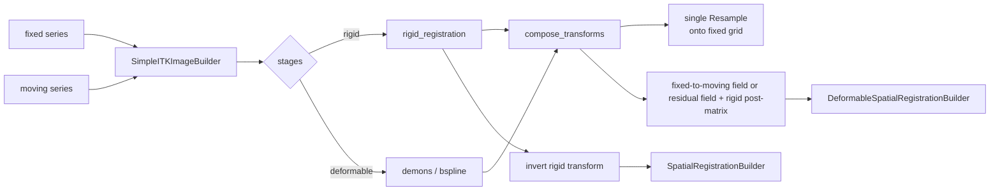
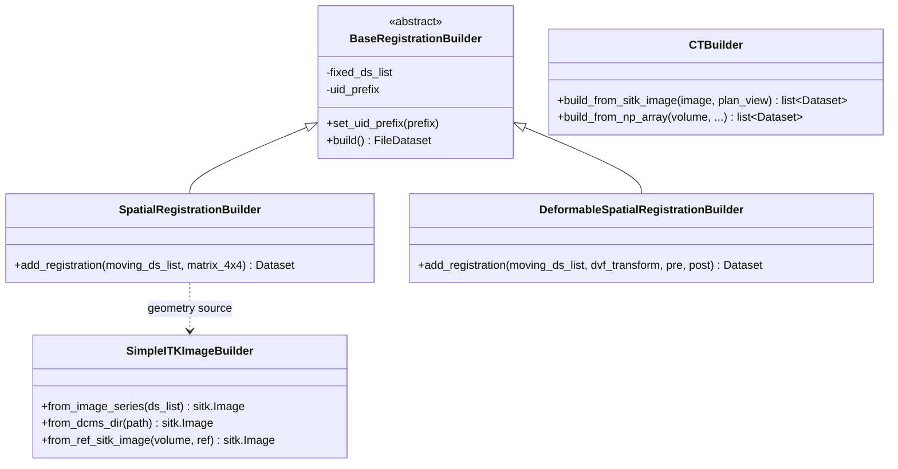

# pydicomRT Architecture

How the library is put together, what each layer is responsible for, and where to extend it.

For usage, see [README.md](../README.md) for the tour, [user-guide.md](user-guide.md) for
the manual, and [api-reference.md](api-reference.md) for the per-function reference. For the coordinate conventions — which matter more than anything on this page —
see the *Conventions* section of the README, or [AGENTS.md](../AGENTS.md).

---

## Design position

pydicomRT sits between two worlds that describe the same geometry differently:

```
      pydicom Datasets                          numpy / SimpleITK
   (DICOM tags, patient mm)   <-- pydicomRT -->   (arrays, grids)
```

Almost every bug class this library has to defend against lives at that boundary: an axis
order reversed, a spacing pair swapped, a transform pointing the wrong way. None of them
raise. They produce a plausible image in the wrong place.

Three principles follow:

1. **Geometry conversion is centralised.** `utils/sitk_transform.py` owns the DICOM ↔
   SimpleITK translation (`get_sitk_spacing`, `get_sitk_direction`, and the inverse
   helpers). Modules that need it call those rather than indexing tags themselves.
2. **Direction is stated, never inferred.** Every function returning a transform documents
   which way it points. The library's internal convention is *fixed → moving* (resampling);
   DICOM Spatial REG is *moving → fixed*; Deformable REG remains *fixed → moving*.
   Inversion happens only at the Spatial REG export boundary.
3. **Builders take a reference series.** Patient, study, and frame-of-reference context is
   copied from real image datasets rather than invented, so the output files into the same
   study as the images they describe.
4. **One shape per role.** Every package exposes `builder.py` (construct), `parser.py`
   (read), `check.py` + `iod.py` (validate). Every builder is `set_*` / `add_*` / `build()`,
   every checker returns `{"result": bool, "content": [...]}`. The point is that knowing one
   module tells you how to use the next.

---

## Layers

```
                 rs/            reg/           dose/          ct/
             (RTSTRUCT)     (REG, DR)        (RTDOSE)      (CT Image)
                  \             |               |            /
                   \            |               |           /
                    +-----------+---------------+----------+
                                     |
                                  utils/
                    series loading · coordinate transforms
                    DICOM <-> SimpleITK · image preprocessing
```

`utils` knows nothing about the modality packages. The modality packages depend on `utils`
and on each other only through `utils`.

### `utils/` — the shared foundation

| Module | Responsibility |
|---|---|
| `image_series_loader` | Read a directory or file list; **sort along the slice normal**. Everything downstream assumes this ordering. |
| `sitk_transform` | `SimpleITKImageBuilder`, the geometry conversion helpers, and `resample_to_reference_image`. |
| `coordinate_transform` | Pixel ↔ patient 4×4 affines, used to place contour points. |
| `validate_dcm_info` | Generic IOD field checks that the per-modality checkers build on. |
| `sitk_image_process` | Bilateral / median denoise, N4 bias field correction. |

### `rs/` — RTSTRUCT

The mask ↔ contour round trip is the most-used path in the library.

```
mask (z, y, x)                                        RTSTRUCT
      |                                                   |
      | make_contour_sequence.add_contour_sequence_from_mask3d
      |   - cv2.findContours per slice                    |
      |   - contour_process: noise removal, low-pass      |
      |   - coordinate_transform: pixel -> patient        |
      v                                                   v
  ContourSequence  ------------------------------>  ROIContourSequence
      ^                                                   |
      |   rs_to_volume.rtstruct_to_masks              |
      |   - calc_image_series_affine_mapping (patient -> pixel)
      |   - cv2.fillPoly per slice                        |
      +---------------------------------------------------+
```

The two directions derive their affines from **separate** code paths
(`coordinate_transform` on the way out, `rs_to_volume` on the way back). They must agree;
`test/rs/test_rs_roundtrip.py` pins that with anisotropic spacing, which is the only case
where a disagreement is visible.

### `reg/` — registration

Three distinct concerns, deliberately separated:

| Layer | What it does | Coordinate convention |
|---|---|---|
| `reg/method/` | Runs SimpleITK registration algorithms | returns *fixed → moving* |
| `reg/pipeline/` | Sequences stages, preprocessing, composition | same |
| `reg/builder.py`, `reg/parser.py` | Spatial REG serialisation | *moving → fixed* |
| `reg/builder.py`, `reg/parser.py` | Deformable REG serialisation | *fixed → moving* |

The direction flip applies only to Spatial REG export. `type_transform.py` holds the conversions
(`affine_to_homogeneous_matrix`, displacement field → `VectorGridData`).



Two invariants this structure exists to protect:

- **Compose, then resample once.** `compose_transforms` folds the stage list into one
  transform. Resampling per stage crops to the fixed grid each time, discarding content a
  later stage would have brought back, and compounds interpolation blur.
- **Preprocessing must not reach the output.** Window clipping and extent cropping are
  registration aids applied to *copies*. The returned image is always a single resample of
  the untouched moving image, so callers keep their original HU values.

### `dose/` and `ct/`

Thin serialisation layers: build a `FileDataset` with the required IOD fields, copy patient
and study context from a reference dataset, attach the pixel data with the right geometry.
`dose/sitk_transform.py` is the read path, applying `DoseGridScaling`.

---

## Key types



`rs/`, `dose/` and `reg/parser.py` are function-based rather than class-based; each package's
`__init__.py` is the public surface.

---

## Extension points

**A new registration algorithm.** Add a module under `reg/method/` returning a
`sitk.Transform` in the *fixed → moving* direction (plus a displacement field for deformable
methods), and export it from `reg/method/__init__.py`. The builders and `compose_transforms`
work unchanged.

**Contour post-processing.** `rs/contour_process_method.py` holds the noise-removal and
low-pass filtering applied per contour. `add_contour_sequence_from_mask3d` takes a
`ctr_config` dict, so tuning does not require touching the module.

**Wider IOD coverage.** Each package's `iod.py` lists the required fields for its object
and `check.py` validates against it. Both grow together.

**A new modality.** Follow `ct/`: `iod.py` describing the fields, `check.py` validating
against it, and a `builder.py` exposing `set_*` / `add_*` / `build()` that copies
patient/study context from a reference series.

---

## Testing strategy

| Layer | Location | Runs by default |
|---|---|---|
| Synthetic DICOM and phantoms | `test/synthetic.py` | — |
| Unit and contract tests | `test/` | yes, seconds |
| Real clinical CT / CBCT / REG | `test/real_data/` | fast subset yes, `-m slow` opt-in |

Synthetic fixtures are built by the same reading of the standard the library uses, so they
agree with it by construction. That makes them good at catching *regressions* and poor at
catching *misreadings*. The real-data layer covers the second case: `test/real_data/`
cross-checks series loading against SimpleITK's own GDCM reader and checks registration
output against a TPS-produced registration.

Deliberate gaps, recorded rather than hidden:

- Both real series are axial with square pixels, so they cannot exercise the row/column
  spacing or direction-matrix conventions. That stays with the anisotropic and rotated
  synthetic fixtures.
The real-data layer has already earned its keep twice, and both times the gap had first
been written up with a plausible explanation attached.

A 37 mm superior-inferior error was recorded as a field-of-view limitation of the CBCT. It
was the optimizer walking away from a correct starting position and reporting convergence;
a step size that shrinks on gradient reversal took it under 1 mm.

`registration_pipeline` landing 194 mm out was recorded as a field-of-view mismatch. It was
the pipeline resampling both images onto a shared grid before registering, which leaves
`CenteredTransformInitializer` with two identical grids and therefore nothing to estimate.

Neither would have surfaced on a synthetic phantom built to the library's own conventions,
and in both cases the plausible explanation would have stood unchallenged.

---

## Dependencies

- Python ≥ 3.10 (`ct/builder.py` uses structural pattern matching)
- `pydicom` 3, `numpy`, `SimpleITK`; `opencv-python` for contour extraction, `scipy` for
  contour filtering

UID roots: `rs/` and `dose/` read the `DICOM_UID_PREFIX` environment variable; `reg/` and
`ct/` take `set_uid_prefix()`.
